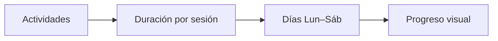

# Weekly Commit

> **Alcanza tus metas, una semana a la vez.**

Aplicación web de productividad para planificar actividades semanales: define qué harás, cuánto tiempo dedicarás cada día y marca el progreso en una cuadrícula clara de **lunes a sábado**. Los datos se guardan en el navegador para que vuelvas donde lo dejaste.

---

## Tabla de contenidos

1. [Características](#características)
2. [Captura de concepto](#captura-de-concepto)
3. [Stack técnico](#stack-técnico)
4. [Requisitos](#requisitos)
5. [Instalación y desarrollo](#instalación-y-desarrollo)
6. [Scripts disponibles](#scripts-disponibles)
7. [Personalización](#personalización)
8. [Licencia y notas](#licencia-y-notas)

---

## Características

| Área | Descripción |
|------|-------------|
| **Cuadrícula semanal** | Filas por actividad; columnas por día laborable (lun–sáb). |
| **Actividades** | Nombre, duración elegida entre opciones fijas y casillas de “hecho” por día. |
| **Totales** | Resumen de tiempo planificado según lo que marques en la semana. |
| **Temas visuales** | Tres estilos: *Paper planner*, *Graphite* y *Botanical flow*. |
| **Apariencia** | Modo claro u oscuro, aplicado de forma coherente en toda la interfaz. |
| **Persistencia** | Estado guardado en `localStorage` (actividades, tema y apariencia). |

### Flujo de uso (resumen)

```text
Añadir actividad → Completar nombre y duración → Marcar días completados
```

*Las filas en borrador (sin nombre) no se persisten hasta que definas la actividad.*

---

## Captura de concepto



---

## Stack técnico

- [**Next.js**](https://nextjs.org/) — App Router, renderizado híbrido.
- [**React**](https://react.dev/) 19 — Interfaz declarativa.
- [**TypeScript**](https://www.typescriptlang.org/) — Tipado estático.
- [**Tailwind CSS**](https://tailwindcss.com/) 4 — Estilos utilitarios.
- [**Zustand**](https://zustand-demo.pmnd.rs/) — Estado global con middleware `persist`.
- [**Lucide React**](https://lucide.dev/) — Iconografía.

> **Nota:** Esta base usa una versión reciente de Next.js; conviene revisar la documentación oficial del proyecto si algo difiere de lo que recuerdas de versiones anteriores.

---

## Requisitos

- **Node.js** — Versión compatible con Next.js 16 (recomendado: LTS actual).
- Un gestor de paquetes: `npm`, `pnpm`, `yarn` o `bun`.

---

## Instalación y desarrollo

1. **Clona el repositorio** (ajusta la URL a la tuya):

   ```bash
   git clone <url-del-repositorio>
   cd weekly-commit
   ```

2. **Instala dependencias:**

   ```bash
   npm install
   ```

3. **Arranca el servidor de desarrollo:**

   ```bash
   npm run dev
   ```

4. Abre en el navegador: [http://localhost:3000](http://localhost:3000)

---

## Scripts disponibles

| Comando | Propósito |
|---------|-----------|
| `npm run dev` | Servidor de desarrollo con recarga en caliente. |
| `npm run build` | Compilación de producción. |
| `npm run start` | Sirve la build de producción (tras `build`). |
| `npm run lint` | Ejecuta ESLint sobre el proyecto. |

---

## Personalización

- **Temas y apariencia:** definidos en `lib/themes.ts`, estilos en `app/globals.css` y fuentes en `lib/theme-fonts.ts`.
- **Duraciones y días:** constantes en `lib/weekly-grid/constants.ts`.
- **Estado persistido:** clave `weekly-commit` en `localStorage` (ver `store/index.ts`).

---

## Licencia y notas

Este proyecto es **privado** según `package.json`. Ajusta la licencia y esta sección cuando publiques o compartas el código.

---

<p align="center">
  <sub>Hecho con enfoque en claridad semanal y una interfaz agradable de usar cada día.</sub>
</p>
